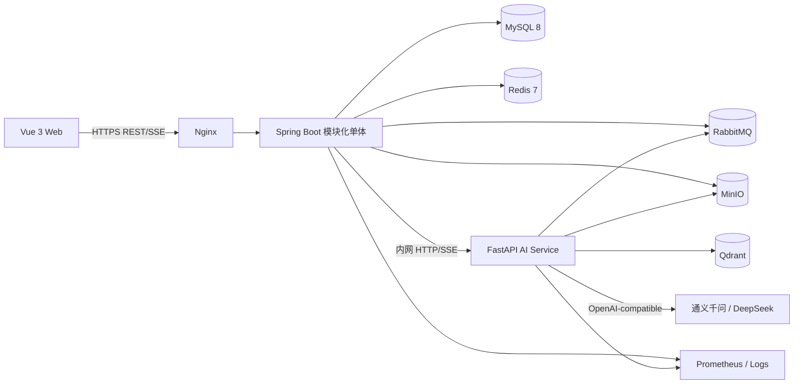
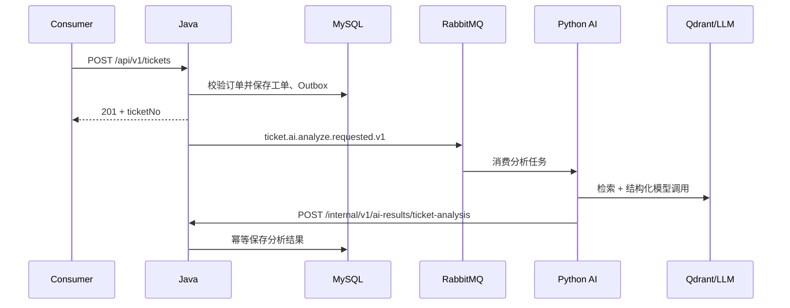
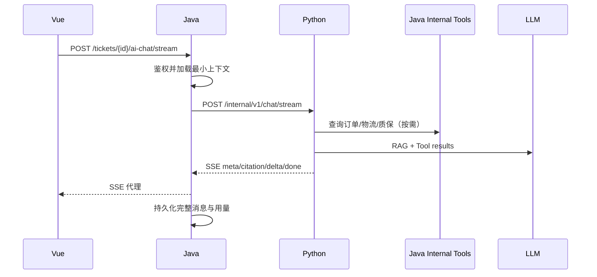
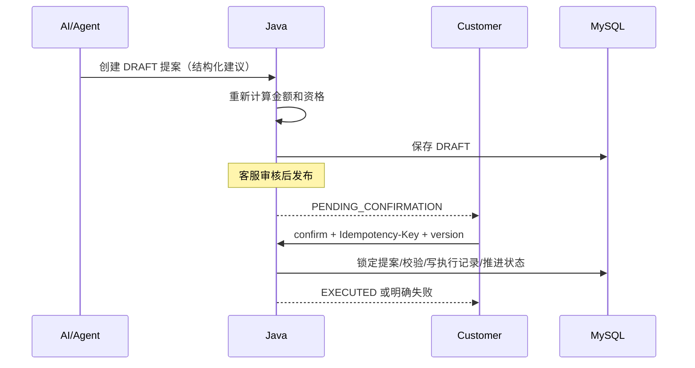

# 02. 系统架构

## 1. 总体架构



### 1.1 职责边界

| 能力 | Java 服务 | Python AI 服务 |
|---|---|---|
| 用户、角色、鉴权 | 权威实现 | 只信任 Java 传入的内部身份，不签发用户 Token |
| 商品、订单、物流、质保 | 权威数据和校验 | 通过受控只读工具查询 |
| 工单状态机、分配、提案执行 | 权威实现 | 提供分类和提案建议 |
| 事务、幂等、审计 | 权威实现 | 记录 AI 调用轨迹，不执行业务事务 |
| 文档元数据和权限 | 权威实现 | 解析、切片、向量化、检索 |
| LLM、Embedding、Rerank | 保存配置引用和成本汇总 | 模型适配、调用、结构化输出 |
| SSE | 鉴权、代理、审计和断开处理 | 生成事件流 |

## 2. Java 模块化单体

建议根包 `com.aftersales.copilot`，模块使用 Maven 多模块或单项目严格分包。为了 4 周范围，推荐 Maven 多模块但只部署一个 JAR：

```text
aftersales-server/
├─ bootstrap/       # Spring Boot 启动、统一配置
├─ common/          # 结果、异常、基础类型、工具
├─ auth/            # 登录、JWT、RBAC
├─ catalog/         # 商品、SKU、质保基础资料
├─ order/           # 订单、支付、物流模拟数据
├─ ticket/          # 工单聚合、状态机、分配、消息
├─ proposal/        # 提案、确认、业务执行
├─ knowledge/       # 文档元数据、上传、索引任务
├─ aiadapter/       # Python API、SSE、MQ 契约适配
├─ statistics/      # 看板查询
└─ audit/           # 审计日志
```

模块之间通过应用服务接口或领域事件协作，禁止 Controller 直接调用其他模块 Mapper。第一版不强制 DDD 全套战术模式，但必须区分 Controller、Application Service、Domain、Infrastructure。

## 3. Python AI 服务

```text
ai-service/
├─ app/
│  ├─ api/              # 内部 HTTP 与 SSE 路由
│  ├─ core/             # 配置、安全、日志、异常
│  ├─ schemas/          # Pydantic 输入输出契约
│  ├─ providers/        # Qwen/DeepSeek/Embedding 适配器
│  ├─ workflows/        # LangGraph 工作流
│  ├─ rag/              # 解析、切片、检索、重排、引用
│  ├─ tools/            # 调 Java 只读内部 API
│  ├─ prompts/          # 版本化模板
│  ├─ consumers/        # RabbitMQ 消费者
│  ├─ repositories/     # Qdrant、AI 调用记录必要访问
│  └─ observability/    # metrics、tracing、cost
├─ tests/
├─ evals/
└─ main.py
```

Python 不连接 Java 的 MySQL。需要工单事实时，由 Java 在任务消息中提供必要快照，或调用带内部鉴权的只读 API。

## 4. 关键调用链

### 4.1 创建与分析工单



消息发送采用 Transactional Outbox：Java 与工单在同一事务写入 `outbox_event`，后台发布器投递 RabbitMQ，成功后标记已发布。这样不会出现“工单已创建但消息永久丢失”。

### 4.2 AI 对话



浏览器使用 `fetch` 读取 POST SSE 流，因为原生 `EventSource` 不支持自定义 Authorization Header 和 POST body。

### 4.3 提案执行



## 5. 数据一致性策略

- 单 Java 服务内使用本地数据库事务。
- RabbitMQ 使用 Outbox + 消费幂等，不尝试分布式事务。
- Python 回调携带 `taskId`，Java 对 `taskId + resultType` 建唯一索引。
- 工单使用 `version` 乐观锁；执行提案时同时锁定提案行。
- Qdrant 是派生数据，可由 MySQL 文档版本重新构建。
- AI 消息流断开时，Java 保存已收到内容并标记 `INTERRUPTED`，不将半截内容当作正式客服回复。

## 6. 环境拓扑

### 开发环境

- IDEA 运行 Java，命令行/IDE 运行 Python 和 Vue。
- Docker Compose 只启动 MySQL、Redis、RabbitMQ、Qdrant、MinIO。
- Java 21 toolchain；本机默认 `java -version` 为 24 不影响 Maven toolchain。

### 演示/生产环境

- Docker Compose 启动 Web、Java、Python 和中间件。
- Nginx 只暴露 80/443；Python、数据库、中间件位于内部网络。
- HTTPS 使用域名 + Let's Encrypt；没有域名时可仅本地演示，不伪装生产安全。

## 7. 架构决策记录

| 决策 | 选择 | 原因 |
|---|---|---|
| Java 版本 | 21 LTS | 生态和部署稳定；JDK 24 非 LTS 且无必要特性收益 |
| 服务拆分 | Java 模块化单体 + Python AI | 保留清晰边界，控制 4 周复杂度 |
| AI 框架 | Python LangGraph/LangChain | Python AI 生态成熟，适合 RAG 和工作流 |
| 向量库 | Qdrant | Docker 部署简单，过滤和 payload 适合知识库 |
| 异步 | RabbitMQ + Outbox | 展示可靠消息而不引入 Kafka 复杂度 |
| 流式 | Python SSE → Java → Vue | 统一鉴权、审计和公网入口 |
| 写操作 | Java 确定性执行 | 防止模型幻觉、越权和重复执行 |

