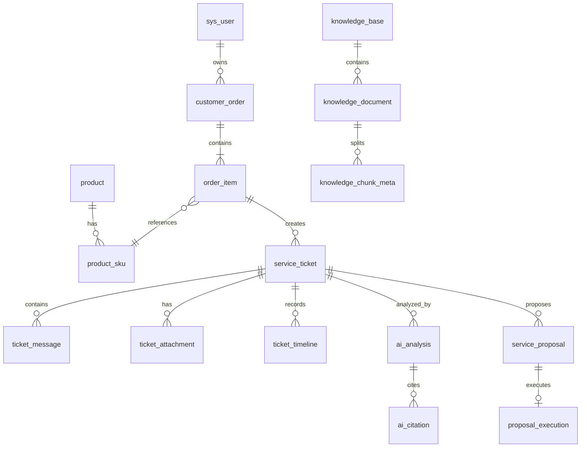

# 03. 数据库设计

## 1. 约定

- 数据库：MySQL 8.0，字符集 `utf8mb4`，排序规则 `utf8mb4_0900_ai_ci`。
- 表名使用单数蛇形命名；业务表均包含 `created_at`、`updated_at`。
- 主键使用 `BIGINT UNSIGNED`，由 Java 雪花 ID 生成；通过 Jackson 序列化为字符串，避免 JavaScript 精度问题。
- 金额使用 `BIGINT`，单位为人民币分；禁止使用 `FLOAT/DOUBLE` 保存金额。
- 时间使用 `DATETIME(3)`，应用统一按 UTC 写入，前端按 `Asia/Shanghai` 展示。
- 可变结构化 AI 数据使用 `JSON`，但可检索和约束的核心业务字段必须独立列出。
- 业务删除默认软删除 `deleted_at`；审计、消息、执行记录不允许业务删除。
- `version INT NOT NULL DEFAULT 0` 用于乐观锁。
- 枚举在数据库使用 `VARCHAR`，Java/Python 均使用同名字符串枚举，避免数字枚举错位。

## 2. 核心关系



## 3. 账号与权限

### 3.1 `sys_user`

| 字段 | 类型 | 约束/说明 |
|---|---|---|
| `id` | BIGINT UNSIGNED | PK |
| `username` | VARCHAR(64) | UNIQUE，登录名 |
| `email` | VARCHAR(128) | UNIQUE，可空 |
| `password_hash` | VARCHAR(100) | BCrypt |
| `display_name` | VARCHAR(64) | 展示名 |
| `role` | VARCHAR(20) | `CUSTOMER/AGENT/ADMIN` |
| `status` | VARCHAR(20) | `ACTIVE/DISABLED/LOCKED` |
| `agent_online` | TINYINT(1) | 客服是否参与自动分配，非客服固定 false |
| `last_assigned_at` | DATETIME(3) | 客服最近分配时间 |
| `last_login_at` | DATETIME(3) | 可空 |
| `version` | INT | 乐观锁 |
| `created_at/updated_at/deleted_at` | DATETIME(3) | 审计时间 |

索引：`uk_user_username`、`uk_user_email`、`idx_user_role_status(role,status,agent_online)`。

### 3.2 `auth_refresh_token`

只保存 Refresh Token 的 SHA-256 哈希，不保存明文。

| 字段 | 类型 | 说明 |
|---|---|---|
| `id` | BIGINT UNSIGNED | PK |
| `user_id` | BIGINT UNSIGNED | 用户 |
| `token_hash` | CHAR(64) | UNIQUE |
| `expires_at` | DATETIME(3) | 过期时间 |
| `revoked_at` | DATETIME(3) | 撤销时间，可空 |
| `device_info` | VARCHAR(255) | 可空，截断后的 UA/设备描述 |
| `created_at/updated_at` | DATETIME(3) | 时间 |

## 4. 商品、订单和物流

### 4.1 `product`

| 字段 | 类型 | 说明 |
|---|---|---|
| `id` | BIGINT UNSIGNED | PK |
| `product_code` | VARCHAR(32) | UNIQUE |
| `name` | VARCHAR(128) | 商品名 |
| `brand` | VARCHAR(64) | 品牌 |
| `category` | VARCHAR(64) | 手机/耳机/键盘等 |
| `description` | TEXT | 描述 |
| `status` | VARCHAR(20) | `ACTIVE/INACTIVE` |
| `created_at/updated_at/deleted_at` | DATETIME(3) | 时间 |

### 4.2 `product_sku`

| 字段 | 类型 | 说明 |
|---|---|---|
| `id` | BIGINT UNSIGNED | PK |
| `product_id` | BIGINT UNSIGNED | 商品 ID |
| `sku_code` | VARCHAR(48) | UNIQUE |
| `spec_json` | JSON | 如颜色、容量 |
| `sale_price_cent` | BIGINT | 售价快照默认值 |
| `warranty_months` | INT | 默认质保月数 |
| `serial_required` | TINYINT(1) | 维修/换货是否需序列号 |
| `status` | VARCHAR(20) | `ACTIVE/INACTIVE` |
| `created_at/updated_at/deleted_at` | DATETIME(3) | 时间 |

### 4.3 `warranty_rule`

| 字段 | 类型 | 说明 |
|---|---|---|
| `id` | BIGINT UNSIGNED | PK |
| `rule_code` | VARCHAR(40) | UNIQUE |
| `name` | VARCHAR(128) | 规则名 |
| `scope_type` | VARCHAR(20) | `GLOBAL/CATEGORY/PRODUCT/SKU` |
| `scope_id` | BIGINT UNSIGNED | GLOBAL 时为空 |
| `refund_only_days` | INT | 仅退款窗口 |
| `return_refund_days` | INT | 退货退款窗口 |
| `exchange_days` | INT | 换货窗口 |
| `repair_days` | INT | 维修受理窗口，可按质保期折算 |
| `requires_unopened` | TINYINT(1) | 是否要求未拆封 |
| `effective_from/effective_to` | DATETIME(3) | 生效区间 |
| `status` | VARCHAR(20) | `DRAFT/ACTIVE/INACTIVE` |
| `rule_json` | JSON | 额外限制，不能替代核心窗口字段 |
| `version` | INT | 乐观锁 |
| `created_at/updated_at` | DATETIME(3) | 时间 |

规则匹配优先级：`SKU > PRODUCT > CATEGORY > GLOBAL`；同级选择当前有效且 `effective_from` 最新的一条。

### 4.4 `customer_order`

| 字段 | 类型 | 说明 |
|---|---|---|
| `id` | BIGINT UNSIGNED | PK |
| `order_no` | VARCHAR(32) | UNIQUE，对外订单号 |
| `customer_id` | BIGINT UNSIGNED | 所属用户 |
| `status` | VARCHAR(20) | `PAID/SHIPPED/DELIVERED/CANCELLED` |
| `total_amount_cent` | BIGINT | 订单总额 |
| `paid_amount_cent` | BIGINT | 实付金额 |
| `paid_at/shipped_at/delivered_at` | DATETIME(3) | 可空 |
| `receiver_snapshot` | JSON | 脱敏展示；禁止日志输出完整地址/电话 |
| `version` | INT | 乐观锁 |
| `created_at/updated_at` | DATETIME(3) | 时间 |

### 4.5 `order_item`

| 字段 | 类型 | 说明 |
|---|---|---|
| `id` | BIGINT UNSIGNED | PK |
| `order_id` | BIGINT UNSIGNED | 订单 |
| `sku_id` | BIGINT UNSIGNED | SKU |
| `product_name_snapshot` | VARCHAR(128) | 下单快照 |
| `sku_spec_snapshot` | JSON | 规格快照 |
| `unit_price_cent` | BIGINT | 单价 |
| `quantity` | INT | 数量，MVP 演示数据建议 1 |
| `paid_amount_cent` | BIGINT | 该项实付 |
| `refunded_amount_cent` | BIGINT | 已模拟退款总额 |
| `serial_number` | VARCHAR(80) | 可空，展示需脱敏 |
| `warranty_expire_at` | DATETIME(3) | 质保到期 |
| `version` | INT | 乐观锁 |
| `created_at/updated_at` | DATETIME(3) | 时间 |

约束：`refunded_amount_cent >= 0 AND refunded_amount_cent <= paid_amount_cent` 由应用强制保证，数据库可增加 CHECK。

### 4.6 `payment_record`

`payment_no` UNIQUE；字段含 `order_id`、`channel=MOCK`、`amount_cent`、`status=PAID/REFUNDED/PARTIAL_REFUNDED`、`paid_at`。

### 4.7 `logistics_shipment` 与 `logistics_event`

`logistics_shipment`：`shipment_no`、`order_id`、`type=OUTBOUND/RETURN/REPLACEMENT/REPAIR_RETURN`、`carrier_code`、`tracking_no`、`status`、`shipped_at`、`delivered_at`。

`logistics_event`：`shipment_id`、`event_time`、`status_code`、`description`、`location`。按 `(shipment_id,event_time)` 建索引。

## 5. 工单聚合

### 5.1 `service_ticket`

| 字段 | 类型 | 约束/说明 |
|---|---|---|
| `id` | BIGINT UNSIGNED | PK |
| `ticket_no` | VARCHAR(32) | UNIQUE，如 `AS202609210001`，由号段/随机后缀生成 |
| `customer_id` | BIGINT UNSIGNED | 用户 |
| `order_id` | BIGINT UNSIGNED | 订单 |
| `order_item_id` | BIGINT UNSIGNED | 订单项 |
| `requested_type` | VARCHAR(24) | 用户诉求类型 |
| `confirmed_type` | VARCHAR(24) | 客服确认类型，可空 |
| `status` | VARCHAR(24) | 工单状态 |
| `priority` | VARCHAR(16) | `LOW/MEDIUM/HIGH/URGENT` |
| `title` | VARCHAR(160) | 可由 Java 截取描述生成，AI 后续可建议修改 |
| `description` | TEXT | 用户原始描述，不允许被 AI 覆盖 |
| `assigned_agent_id` | BIGINT UNSIGNED | 可空 |
| `first_response_at` | DATETIME(3) | 首次人工公开回复时间 |
| `resolved_at/closed_at` | DATETIME(3) | 可空 |
| `resolution_code` | VARCHAR(32) | 可空，如 `REFUNDED/EXCHANGED/REPAIRED/REJECTED` |
| `resolution_note` | TEXT | 可空 |
| `version` | INT | 乐观锁，所有状态命令必须携带 |
| `created_at/updated_at` | DATETIME(3) | 时间 |

索引：

- `uk_ticket_no(ticket_no)`
- `idx_ticket_customer(customer_id,created_at)`
- `idx_ticket_agent_status(assigned_agent_id,status,updated_at)`
- `idx_ticket_status_priority(status,priority,created_at)`
- 活跃工单唯一性由 `active_ticket_guard` 的数据库唯一键保证；Redis 锁只用于减少冲突，不能替代数据库约束。

### 5.2 `active_ticket_guard`

| 字段 | 类型 | 说明 |
|---|---|---|
| `order_item_id` | BIGINT UNSIGNED | PK；一个订单项最多一个活动工单 |
| `ticket_id` | BIGINT UNSIGNED | UNIQUE |
| `created_at` | DATETIME(3) | 创建时间 |

创建工单时在同一事务插入 guard，唯一键冲突返回 `ACTIVE_TICKET_EXISTS`。工单进入 `RESOLVED`、`REJECTED` 或 `CANCELLED` 时在同一事务删除 guard；`CLOSED` 是归档状态，不再操作 guard。若事务回滚，工单与 guard 一并回滚。

### 5.3 `ticket_assignment_log`

字段：`ticket_id`、`from_agent_id`、`to_agent_id`、`assign_type=AUTO/MANUAL/CLAIM/TRANSFER`、`reason`、`operator_id`、`created_at`。

### 5.4 `ticket_message`

| 字段 | 类型 | 说明 |
|---|---|---|
| `id` | BIGINT UNSIGNED | PK |
| `ticket_id` | BIGINT UNSIGNED | 工单 |
| `sender_type` | VARCHAR(20) | `CUSTOMER/AGENT/AI/SYSTEM` |
| `sender_id` | BIGINT UNSIGNED | AI/SYSTEM 可空 |
| `visibility` | VARCHAR(20) | `PUBLIC/INTERNAL` |
| `message_type` | VARCHAR(20) | `TEXT/REQUEST_INFO/PROPOSAL/SYSTEM` |
| `content` | MEDIUMTEXT | 完整消息 |
| `ai_message_id` | BIGINT UNSIGNED | 若基于 AI 建议，可空 |
| `created_at/updated_at` | DATETIME(3) | 消息不物理删除 |

### 5.5 `ticket_attachment`

字段：`ticket_id`、`message_id`（可空）、`uploader_id`、`object_key`、`original_name`、`content_type`、`size_bytes`、`sha256`、`scan_status=PENDING/CLEAN/REJECTED`、时间。对象必须私有，下载由 Java 校验工单权限后签发短期 URL。

### 5.6 `ticket_timeline`

不可变事件视图：`ticket_id`、`event_type`、`actor_type`、`actor_id`、`summary`、`detail_json`、`created_at`。只记录用户可见或客服工作所需时间线；安全审计另存 `audit_log`。

### 5.7 `ticket_rating`

字段：`ticket_id UNIQUE`、`customer_id`、`score TINYINT`（1～5）、`comment VARCHAR(1000)`、`created_at`、`updated_at`。只允许工单所属用户评价；首次评价后是否允许在短时间内修改由产品规则决定，MVP 可在 24 小时内修改一次并记录审计。

## 6. AI 相关

### 6.1 `ai_task`

| 字段 | 类型 | 说明 |
|---|---|---|
| `id` | BIGINT UNSIGNED | PK，同时作为 `taskId` |
| `biz_type` | VARCHAR(32) | `TICKET_ANALYSIS/DOCUMENT_INDEX/CLOSURE_SUMMARY` |
| `biz_id` | BIGINT UNSIGNED | 工单或文档 ID |
| `status` | VARCHAR(20) | `PENDING/RUNNING/SUCCEEDED/FAILED/DEAD` |
| `attempt_count` | INT | 尝试次数 |
| `max_attempts` | INT | 默认 3 |
| `request_snapshot` | JSON | 去敏后的任务输入快照 |
| `error_code/error_message` | VARCHAR/TEXT | 可空，错误信息需去密钥 |
| `started_at/finished_at/next_retry_at` | DATETIME(3) | 可空 |
| `created_at/updated_at` | DATETIME(3) | 时间 |

唯一约束建议：业务侧用 `dedup_key VARCHAR(128) UNIQUE`，例如 `TICKET_ANALYSIS:{ticketId}:{ticketVersion}`。

### 6.2 `ai_analysis`

字段：

- `ticket_id`、`task_id UNIQUE`
- `intent`、`confidence DECIMAL(5,4)`
- `priority_suggestion`、`sentiment`
- `extracted_json`、`missing_fields_json`
- `reply_suggestion MEDIUMTEXT`
- `proposal_suggestion_json`
- `needs_human TINYINT(1)`、`risk_flags_json`
- `provider`、`model`、`prompt_version`
- `input_tokens/output_tokens`、`estimated_cost_micros`（人民币微元，1 元 = 1,000,000）
- `latency_ms`、`created_at`

保留历史分析，不覆盖旧记录。工单详情默认取最新成功记录。

### 6.3 `ai_chat_message`

字段：`ticket_id`、`conversation_id`、`role=USER/ASSISTANT/TOOL/SYSTEM`、`content`、`status=STREAMING/COMPLETED/INTERRUPTED/FAILED`、`provider`、`model`、`usage_json`、`created_at`。Tool 内容保存经过脱敏的摘要，不保存内部 Token。

### 6.4 `ai_citation`

字段：`source_type=ANALYSIS/CHAT/SUMMARY`、`source_id`、`document_id`、`chunk_id`、`document_title`、`section_title`、`quote_text`、`score DECIMAL(8,6)`、`created_at`。`quote_text` 限制长度，例如 1000 字符。

### 6.5 `ai_call_log`

保存请求级元数据，不默认保存完整 Prompt：`trace_id`、`task_id`、`provider`、`model`、`operation`、Token、估算成本、延迟、状态、错误码、`prompt_hash`、时间。生产模式禁止存储密码、密钥、完整地址和电话。

## 7. 提案与售后执行

### 7.1 `service_proposal`

| 字段 | 类型 | 说明 |
|---|---|---|
| `id` | BIGINT UNSIGNED | PK |
| `proposal_no` | VARCHAR(32) | UNIQUE |
| `ticket_id` | BIGINT UNSIGNED | 工单 |
| `type` | VARCHAR(24) | 四种售后类型 |
| `source` | VARCHAR(16) | `AI/AGENT` |
| `status` | VARCHAR(24) | 提案状态 |
| `refund_amount_cent` | BIGINT | 非退款类可为 0 |
| `reason_code` | VARCHAR(40) | 结构化原因 |
| `description` | TEXT | 给用户看的方案 |
| `conditions_json` | JSON | 是否寄回、地址、费用承担等 |
| `created_by` | BIGINT UNSIGNED | 客服 ID；AI 草稿可空 |
| `reviewed_by` | BIGINT UNSIGNED | AI 草稿审核人 |
| `expires_at` | DATETIME(3) | 有效期 |
| `confirmed_at/rejected_at/executed_at` | DATETIME(3) | 可空 |
| `version` | INT | 乐观锁 |
| `created_at/updated_at` | DATETIME(3) | 时间 |

### 7.2 `proposal_execution`

| 字段 | 类型 | 说明 |
|---|---|---|
| `id` | BIGINT UNSIGNED | PK |
| `proposal_id` | BIGINT UNSIGNED | UNIQUE，MVP 每提案一次最终执行记录 |
| `idempotency_key` | VARCHAR(64) | UNIQUE |
| `status` | VARCHAR(20) | `PROCESSING/SUCCEEDED/FAILED` |
| `executor_id` | BIGINT UNSIGNED | 触发确认的用户/客服 |
| `request_hash` | CHAR(64) | 防止相同 Key 携带不同请求 |
| `result_json` | JSON | 退款号、退货号、维修号等 |
| `error_code/error_message` | VARCHAR/TEXT | 可空 |
| `created_at/updated_at` | DATETIME(3) | 时间 |

这里的 `SUCCEEDED` 表示“确认命令已被 Java 幂等地应用”：仅退款会立即生成模拟退款；其他三类会成功创建退货/换货/维修流程并进入 `WAITING_RETURN`。它不等同于整个售后已经 `RESOLVED`。提案在最终业务完成时才更新为 `EXECUTED`。

### 7.3 业务执行记录

- `refund_record`：`refund_no`、`ticket_id`、`proposal_id`、`order_item_id`、`amount_cent`、`status=PROCESSING/SUCCEEDED/FAILED`、时间。
- `return_order`：`return_no`、`ticket_id`、`proposal_id`、`status=WAITING_SHIPMENT/IN_TRANSIT/RECEIVED/INSPECTED`、退货地址快照、物流信息、检查结果。
- `exchange_order`：`exchange_no`、`ticket_id`、`proposal_id`、`return_order_id`、`replacement_sku_id`、`status`、补发物流 ID。
- `repair_order`：`repair_no`、`ticket_id`、`proposal_id`、`return_order_id`、`status=WAITING_RECEIPT/INSPECTING/REPAIRING/SHIPPED_BACK/COMPLETED`、故障结论、维修说明。

## 8. 知识库

### 8.1 `knowledge_base`

字段：`name`、`code UNIQUE`、`description`、`status=ACTIVE/INACTIVE`、`created_by`、时间。

### 8.2 `knowledge_document`

| 字段 | 类型 | 说明 |
|---|---|---|
| `id` | BIGINT UNSIGNED | PK |
| `knowledge_base_id` | BIGINT UNSIGNED | 所属库 |
| `title` | VARCHAR(200) | 标题 |
| `document_type` | VARCHAR(20) | `POLICY/MANUAL/FAQ` |
| `scope_type/scope_id` | VARCHAR/BIGINT | GLOBAL/CATEGORY/PRODUCT/SKU |
| `object_key` | VARCHAR(512) | MinIO 私有对象 |
| `file_name/content_type/size_bytes/sha256` | 多列 | 文件信息 |
| `version_label` | VARCHAR(40) | 业务版本，如 `2026.09` |
| `status` | VARCHAR(20) | 文档状态 |
| `effective_from/effective_to` | DATETIME(3) | 有效期 |
| `chunk_count` | INT | 成功索引片段数 |
| `index_version` | INT | 每次重建递增 |
| `error_message` | TEXT | 可空 |
| `created_by` | BIGINT UNSIGNED | 管理员 |
| `created_at/updated_at/archived_at` | DATETIME(3) | 时间 |

唯一性：`(knowledge_base_id, sha256, index_version)` 或在应用层阻止相同文件重复上传。

### 8.3 `knowledge_chunk_meta`

MySQL 只保存可审计元数据：`document_id`、`chunk_id VARCHAR(80) UNIQUE`、`index_version`、`sequence_no`、`section_title`、`content_hash`、`token_count`、`qdrant_point_id`、时间。原始 chunk 文本可保存在 Qdrant payload，必要时也可存 MinIO 解析产物；引用展示以经过权限检查的片段为准。

Qdrant collection：`aftersales_kb_v1`。payload 至少包含：

```json
{
  "chunkId": "doc_123_v2_0007",
  "documentId": "123",
  "indexVersion": 2,
  "knowledgeBaseId": "10",
  "documentType": "POLICY",
  "scopeType": "PRODUCT",
  "scopeId": "2001",
  "effectiveFrom": "2026-01-01T00:00:00Z",
  "effectiveTo": null,
  "sectionTitle": "七日退货条件",
  "content": "..."
}
```

## 9. 基础设施表

### 9.1 `outbox_event`

字段：`event_id VARCHAR(36) PK`、`aggregate_type`、`aggregate_id`、`event_type`、`routing_key`、`payload JSON`、`status=NEW/SENDING/PUBLISHED/FAILED`、`retry_count`、`next_retry_at`、`published_at`、时间。发布器用 `SELECT ... FOR UPDATE SKIP LOCKED` 批量领取。

### 9.2 `idempotency_record`

用于非提案类幂等接口：`scope`、`idempotency_key`、`request_hash`、`status`、`response_code`、`response_body`、`expires_at`，唯一键 `(scope,idempotency_key)`。

### 9.3 `audit_log`

字段：`trace_id`、`actor_type`、`actor_id`、`action`、`resource_type`、`resource_id`、`result`、`ip`、`user_agent`、`before_json`、`after_json`、`created_at`。敏感字段进入日志前脱敏；审计日志只允许管理员读取，不提供修改和删除 API。

## 10. Redis Key

| Key | 类型 | TTL/用途 |
|---|---|---|
| `auth:refresh:blacklist:{jti}` | String | 到 Token 过期，注销/撤销 |
| `lock:ticket:create:{orderItemId}` | Lock | 10s，防重复活动工单 |
| `lock:ticket:assign:{ticketId}` | Lock | 10s，防重复分配 |
| `rate:api:{userId}:{route}:{window}` | String | API 限流 |
| `rate:ai:{userId}:{minute}` | String | AI 请求限流 |
| `ticket:summary:{ticketId}` | String/JSON | 5min，可选详情缓存；状态变更主动删除 |
| `proposal:confirm:{proposalId}` | Lock | 30s，确认执行互斥；数据库唯一键仍是最终保障 |
| `ai:circuit:{provider}` | String | 熔断状态，可选由 Resilience4j 本地状态替代 |

Redis 不是业务事实来源。丢失 Redis 后，权限、工单状态和提案执行结果仍应可从 MySQL 恢复。
